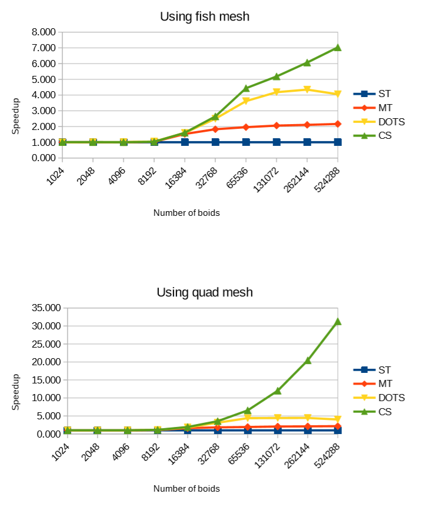

# About
The project contains different CPU and GPU flocking implementations in Unity's game engine, using a single thread and multithread approach, as well as another using compute shaders. All of them are mainly based on Unity's ECS implementation (which was presented by Mike Acton in GDC) and is also included in the project. All of the art assets are from Unity's demo. See Mike's technical presentation at https://youtu.be/p65Yt20pw0g.

I started this project when Unity had already been advertising for about a year their new tech stack "DOTS". I wanted to see what data-oriented design along with the job system and the burst compiler was able to do in terms of performance, so I decided to compare their implementation against other paradigms, replicating their algorithm as much as I could, to make objective comparisons.

This project requires a specific version of the engine in order to work. It is highly recommended to use Unity's 2019.1.14f1 version.

Go to https://unity3d.com/es/get-unity/download/archive to find older releases of Unity.

# Preview
The following gif showcases 524288 boids being simulated in the compute shader.

# My system
The tests I did to get to the results below were made on a release build with an i7 4790k and 980ti, at a resolution of 2560x1440, with default, ultra settings. I was also using an SSD and 16gb of RAM.

# Some results
I used the default fish mesh asset from Unity to make the comparisons, made of 312 triangles.
Additionally, I swapped it for a quad (2 tris) to see how mesh complexity could affect performance.

Abbreviations:

  - ST: single thread (OOP).
  - MT: multi-threaded (OOP).
  - DOTS: Unity's implementation.
  - CS: compute shader.
  

